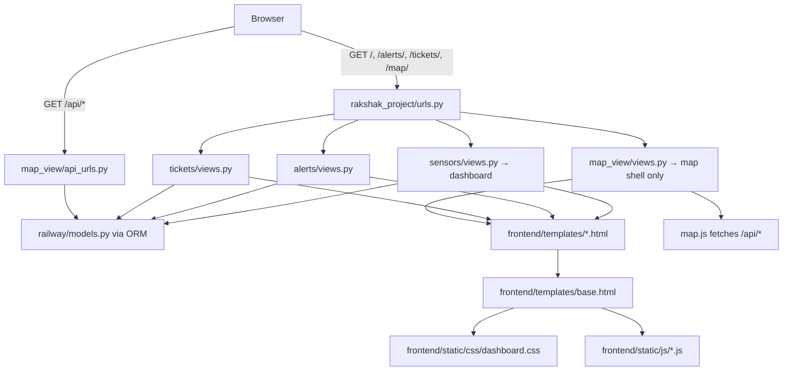

# Rakshak — Codebase Navigation Map

**Rakshak** is a Django 4.2 monolith for railway predictive maintenance: dashboard, alerts, tickets, and an interactive map. Data lives in PostgreSQL via 18 ORM models in `railway`. The UI is server-rendered templates plus vanilla JS (Chart.js, Leaflet).

---

## Top-level layout

```text
Rakshak/
├── backend/              ← Django project + all business logic
├── frontend/             ← HTML templates + CSS/JS (not a separate SPA)
├── docs/                 ← Architecture docs + phase reports
├── notebooks/            ← ML training pipeline (Colab / PyTorch)
├── demo_assets/          ← Demo walkthrough script
├── requirements.txt      ← Django only (Phase 1)
├── check_all_py.py       ← Repo-wide Python syntax checker
└── README.md             ← Setup, features, API list
```

**Entry point:** `backend/manage.py`  
**Config:** `backend/rakshak_project/settings.py`  
**Routing:** `backend/rakshak_project/urls.py`

---

## Request flow (how a page loads)



---

## Backend apps — where to find what

| If you want… | Go here |
|---|---|
| **All DB models (single source of truth)** | `backend/railway/models.py` |
| **Migrations / schema history** | `backend/railway/migrations/` |
| **Django project config** | `backend/rakshak_project/settings.py` |
| **Root URL wiring** | `backend/rakshak_project/urls.py` |
| **Nav bar + branding in every page** | `backend/core/context_processors.py` |
| **Dashboard (home `/`)** | `backend/sensors/views.py` + `backend/sensors/urls.py` |
| **Alerts page `/alerts/`** | `backend/alerts/views.py` + `backend/alerts/urls.py` |
| **Tickets page `/tickets/`** | `backend/tickets/views.py` + `backend/tickets/urls.py` |
| **Map page shell `/map/`** | `backend/map_view/views.py` + `backend/map_view/urls.py` |
| **JSON APIs for map** | `backend/map_view/api_views.py` + `backend/map_view/api_urls.py` |
| **GeoJSON route loader (optional)** | `backend/map_view/services.py` (expects `map_view/route_geometry/india_railways.geojson`) |
| **Future AI agents (placeholder)** | `backend/agents/__init__.py` (empty, Phase 3+) |
| **Django admin** | `backend/railway/admin.py` (not registered yet) |
| **Tests** | `backend/railway/tests.py` (stub) |

---

## Frontend — where to find what

| If you want… | Go here |
|---|---|
| **Shared layout (header, nav, footer)** | `frontend/templates/base.html` |
| **Dashboard UI** | `frontend/templates/dashboard.html` |
| **Alerts UI** | `frontend/templates/alerts.html` |
| **Tickets UI** | `frontend/templates/tickets.html` |
| **Map UI** | `frontend/templates/map.html` |
| **Global styles (dark ops theme)** | `frontend/static/css/dashboard.css` |
| **Clock, KPI animations, Chart.js** | `frontend/static/js/dashboard.js` |
| **Leaflet map + API fetch logic** | `frontend/static/js/map.js` |
| **Moving train markers on map** | `frontend/static/js/train_simulation.js` |

Templates are configured in `settings.py` via `DIRS → frontend/templates/`; static files via `frontend/static/`.

---

## Database models (18 models in one file)

All in `backend/railway/models.py`:

| Layer | Models |
|---|---|
| **Geography** | `Zone`, `Division`, `Station` |
| **Infrastructure** | `TrackSection`, `Asset` |
| **Sensors** | `SensorType`, `Sensor`, `SensorCalibration`, `SensorReading` |
| **Alerts** | `Alert`, `AlertEscalation` |
| **Maintenance** | `MaintenanceTeam`, `Ticket`, `TicketStatusLog` |
| **ML (schema ready)** | `MLModel`, `MLModelRun`, `AnomalyPrediction` |
| **Audit** | `AuditLog` |
| **Base** | `TimeStampedModel` (abstract) |

---

## API endpoints

Defined in `backend/map_view/api_urls.py`:

| URL | Handler | Purpose |
|---|---|---|
| `/api/stations/` | `api_stations` | Station markers + health |
| `/api/routes/` | `api_routes` | Track polylines |
| `/api/alerts/` | `api_alerts` | Active/acknowledged alerts on map |
| `/api/tickets/` | `api_tickets` | Open maintenance tickets |
| `/api/summary/` | `api_summary` | Map stats bar counts |
| `/api/trains/` | `api_trains` | Simulated train positions (time-based) |

Page routes (HTML):

| URL | View |
|---|---|
| `/` | `sensors.views.dashboard` |
| `/alerts/` | `alerts.views.alerts_page` |
| `/tickets/` | `tickets.views.tickets_page` |
| `/map/` | `map_view.views.map_page` |

---

## Seed / demo data commands

Run from `backend/`:

| Command | File | What it seeds |
|---|---|---|
| `python manage.py seed_master_data` | `railway/management/commands/seed_master_data.py` | 18 zones, divisions, 120+ stations |
| `python manage.py seed_routes` | `seed_routes.py` | ~400 track sections + geometry |
| `python manage.py seed_sensors` | `seed_sensors.py` | Sensor types, sensors, readings |
| `python manage.py seed_demo_data` | `seed_demo_data.py` | Alerts, tickets, maintenance teams |

Typical order: **master_data → routes → sensors → demo_data**.

Demo script: `demo_assets/demo_scenario.md`.

---

## ML / analytics (separate from Django app)

| If you want… | Go here |
|---|---|
| **Full Colab notebook** | `notebooks/train_colab.ipynb` |
| **Notebook as Python sections** | `notebooks/section_0.py` … `section_7.py` |
| **Shared ML config contract** | `notebooks/SHARED_CONTRACT.md` |
| **Colab setup guide** | `notebooks/colab_training_tutorial.md` |
| **Colab-only deps** | `notebooks/requirements-colab.txt` |
| **Standalone training script** | `notebooks/train_colab.py` |

Section breakdown (from `section_0.py` header): env setup → data → ADE anomaly detection → HM-STT model → training/eval.

---

## Docs & utilities

| File | Purpose |
|---|---|
| `docs/architecture/system_overview.md` | Phase 1 vs Phase 2+ architecture (note: Phase 1 doc mentions mock data; views now use DB) |
| `docs/reports/PHASE_REPORT.md` | Phase 1 file inventory + status |
| `README.md` | Features, install, structure |
| `backend/validate_api.py` | Manual API URL checker |
| `backend/check_templates.py` | Template validation helper |
| `check_all_py.py` | AST syntax check for all `.py` files |

---

## Quick “Where is X?” lookup

| X | Location |
|---|---|
| **URL routing** | `backend/rakshak_project/urls.py` |
| **Installed Django apps** | `backend/rakshak_project/settings.py` → `INSTALLED_APPS` |
| **Navigation menu items** | `backend/core/context_processors.py` → `navigation()` |
| **KPI cards + sensor charts** | `backend/sensors/views.py` + `dashboard.html` + `dashboard.js` |
| **Alert filtering (`?severity=`)** | `backend/alerts/views.py` |
| **Ticket filtering (`?status=`)** | `backend/tickets/views.py` |
| **Station coordinates** | `railway.models.Station` |
| **Track route geometry** | `railway.models.TrackSection.geometry` |
| **Alert severity / status enums** | `Alert.AlertType`, `Alert.Severity`, `Alert.Status` in `models.py` |
| **Ticket priority / status enums** | `Ticket.Priority`, `Ticket.Status` in `models.py` |
| **Simulated trains on map** | `api_trains()` in `map_view/api_views.py` |
| **PostgreSQL DB** | Configured via `DATABASE_URL` |
| **Auth / login** | Not implemented (Phase 2+) |
| **REST framework** | Not used; plain `JsonResponse` in `api_views.py` |
| **Admin UI for models** | Not wired (`admin.py` is empty) |

---

## Mental model

1. **`railway`** = domain + database (everything persists here).
2. **`sensors`, `alerts`, `tickets`** = thin page views that query ORM and render templates.
3. **`map_view`** = map page + JSON API consumed by `map.js`.
4. **`core`** = shared template context (nav, branding).
5. **`frontend/`** = presentation only (no build step).
6. **`notebooks/`** = offline ML pipeline, not wired into Django yet.
7. **`agents/`** = reserved for future AI orchestration.

---

## Notable gaps (useful when navigating)

- No `mock_data.py` anymore — views read from DB (`sensors/views.py` comment: “No mock data dependencies”).
- `map_view/services.py` references GeoJSON that is **not** in the repo; routes come from `TrackSection.geometry` via `seed_routes`.
- `docs/architecture/system_overview.md` is partially outdated (still describes mock-data Phase 1).
- `presentation/` folder mentioned in README is **not present** in the current tree.

If you tell me a specific “X” (e.g. “alert escalation”, “sensor calibration”, “theme toggle”), I can point to the exact functions and line ranges.